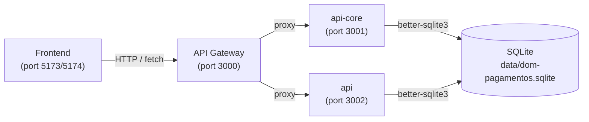

## Request Flow

All client requests originate from a React frontend and are routed through the API Gateway. The gateway proxies each request to either the legacy API Core or the Clean Architecture API depending on the route, and both services read from and write to the same shared SQLite database file.



## Module Dependencies

```
frontend-v2
    └── api-gateway  (all HTTP traffic)
            ├── api-core
            │       └── shared (types)
            └── api
                    └── shared (types)
```

The `shared` package has no runtime dependencies on any other workspace package; it is a pure TypeScript library that all other packages import.

## Service Layer

### api-core (Legacy)
All business logic is concentrated in a single `AppService`. It executes raw SQL directly against the SQLite database and returns results to `AppController`.

| Class | Responsibility |
|---|---|
| `AppController` | Handles all HTTP routes |
| `AppService` | Executes SQL queries; encapsulates all domain logic |

### api (Clean Architecture)
Each feature module exposes the following layers:

| Layer | Classes / files |
|---|---|
| Presentation | `ProductsController`, `CheckoutController` (NestJS REST controllers + DTOs) |
| Application | `GetProductsUseCase`, `CreateCheckoutSessionUseCase`, `ProcessPaymentUseCase`, etc. |
| Infrastructure | `SqliteProductRepository`, `SqliteCheckoutRepository`, domain mappers |
| Domain | `Product`, `CheckoutSession`, `Payment` entities; repository interfaces |

### api-gateway
| Class | Responsibility |
|---|---|
| `GatewayController` | Catches all routes, forwards request + headers to upstream |
| `ProxyService` | Resolves target URL and executes HTTP proxy call |

## Detailed Request Flow — Checkout Example

1. User adds products to cart in `frontend-v2`.
2. Frontend calls `POST /checkout/sessions` via the gateway (port 3000).
3. Gateway proxies the request to `api` (port 3002).
4. `CheckoutController` validates the `CreateCheckoutSessionDto`.
5. `CreateCheckoutSessionUseCase` creates a `CheckoutSession` domain entity.
6. `SqliteCheckoutRepository` persists the session and line items to SQLite.
7. Response flows back through the gateway to the frontend.
8. Frontend navigates to the checkout page and calls `POST /checkout/sessions/:id/pay` to process payment.
9. `ProcessPaymentUseCase` validates the session status, creates a `Payment` record.
10. Frontend redirects to success or cancel page based on the response.

## External Integrations

This project has no external service integrations. There is no third-party payment processor, no email provider, and no external queue. All payment processing is simulated in-process.
